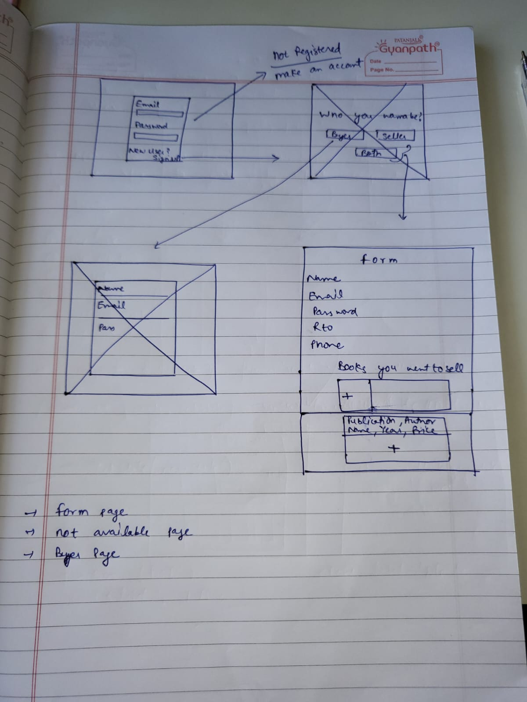

### `Frontflow Environment setting`

- #### 1. Download & install frontflow.
```bash
npm i frontflow
```
- #### 2. Make files like `.gitignore` & choose ES-6 syntax.`type` : `module`. Cut Readme file.
- #### 3. To use this package at max. Without adding git repository.
```bash
npm init
```
- #### To run react server. First add script in package.json file `start: react-scripts start`
```bash
npm start
```
<hr/>

#### `Steps to make this application`

- #### 1. First make the design of application in your copy with pen. Upload it to here in this folder.

- #### 2. Lets first make `formPage`.
    - #### First we make SignIn component & css module.

<hr/>

#### `# Rules`

- #### `Create-react-app`
    - #### we can import relatively only inside `src` directory.
    - #### 
- #### `Fundamentals`
    - #### `rfce` by typing this in `component file` , we can get template of component.
    - #### Variables inside component always enclosed in `{}`.
    - #### Component file name be in either `.jsx` or `.js` format.
    - #### We are not using `CDN's` here, instead we are using npm packages & external webpack.
    - #### Only `0, false, null ,"" , undefined` are considered as false.
    - #### Imagine DOM as a tree like structure. In this structure if we define state in some component. Then if we have to use it in upper level components, then we have to drill the state to all the way to up.
    - #### To get rid of this , we define state outside the component in seprate file.

- #### `Components & props & Events`

    - #### A component name always in capital letters.
    - #### Components are nothing but regular javascript functions that returns `jsx` .
    - #### `Jsx` is always enclosed in parenthesis `()` .
    - #### Inside JSX we cannot use `if-else`. But we can use `{condition ? truthy : falsy}` or `{condition1 && condition2 ...}` or `{condition1 || condition2 ...}`
    - #### As conditions are all about uncertainity , so these are enclosed in `{}`.
    - #### If multiple statements are true , then `&&` returns last truthy statement. And `||` returns first truthy staement.
    - #### `props.children` is used to fetch children elements passed between parents.


- #### `Useful functions`
```js
// map, slice , unshift , forEach , copy operator.

// 1. ()=> { }  , Always enclose in curly braces if there is no single line
  array.forEach((element)=> {
    total += Number(element.amount) ; 
    if(element.amount >= 0) profit += Number(element.amount) ;
    else loss += Number(element.amount) ;
  }) ;
// 2. Events used with forms
// onSubmit
// onChange with input
// 

// Map function
{blogs.map((element,index) => ()) }
```

- #### `Components stylings`
    - #### For css files to work , we need loaders.`css-loaders && style-loader`
    - #### CSS Modules are used to style components, which are named as `fileName.module.css`.
    - #### In css modules styles are written in form of classes only.

```js
// This way you can include ,multiple classes at once....
<p id="money-plus" className={`${styles.money} ${styles.plus}`}>

```

- #### `Hooks`

    - #### `1. useState()`
        - #### If we have to change only `1 property` in state. We first have to copy the prevState using `[...operator]`
        - #### If we are using setState , we dont have to manually render the component again.
    ```js
    import {useState} from 'react' ;

    const [state, setState] = useState(initialState) ;
    setState(newState) ;

    <!-- (e)=>setName(e.target.value) -->

    ```
        
    - #### `2. useRef()`
    ```js
    import {useRef} from 'react' ;

    let inputRef = useRef() ;
    
    <input ref = {inputRef} />

    const tag = inputRef.current.value ;
    // inputRef.current.focus() ;

    ```
    - #### `3. useEffect()`
        - #### All side-effects are performed in this. like `fetching data from API, calling DOM methods , etc.`
        - #### For each different task, we can use different `useEffect()` .
        - #### `only setup function` will be executed component is maded & every time component updates.
        - #### `setup function + empty array` ,executed once only when component is maded.
        - #### `setup function + array with element` , executed when component is maded + everytime when change occur in element.
        - ####  if there is return statement in setup function , that will be executed when component is destroyed.

    ```js
    import {useEffect} from 'react' ;

    useEffect(setup , dependencies) ;

    <!-- Fetching data from API -->
      useEffect(() => {
        fetch("https://api.example.com/data")
        .then((response) => response.json())
        .then((data) => setData(data));
    }, []);

    <!-- Calling SideEffects -->
    useEffect(() => {
    const timer = setInterval(() => {
        console.log("Timer running");
    }, 1000);

    // Cleanup function to clear the interval when the component unmounts
    return () => clearInterval(timer);
    }, []);

    <!-- Local Storage uses -->
       useEffect(()=>{
    const email = localStorage.getItem("email");
    if(email){
        setEmail(email);
    }
    },[]);

    useEffect(() => {
        localStorage.setItem("email", email);
    },[email]);
    ```
    - #### `4. useReducer()`
        - #### If we are manipulating states using `useState` in too many event-handlers or functions. Than we can use this hook.
        - #### `reducer` is a function made outside our component which contains manipulation of state logic.
    ```js
    import {useReducer} from 'react' ;
    
    const [state, dispatch] = useReducer(reducer, initialValue) ;

    <!-- example -1 -->

    const blogsReducer = (state, action) => {
    switch (action.type) {
      case "ADD":
        return [action.blog, ...state];
      case "REMOVE":
        return state.filter((blog, index) => index !== action.index);
      default:
        return [];
    }
  };

    const [blogs, dispatch] = useReducer(blogsReducer,[]);

    dispatch({type: "ADD", blog: {title:formData.title, content:formData.content}});

    ```
    - #### `5. useCustom()`
    ```js

    ```
    - #### `6. Context-API`
        - #### First of all create context in a seprate file.
        - #### Then provide the context. Create context will return 2 values `consumer & provider`
        - #### Consume the context.
    ```js
    import { createContext, useContext} from "react";

    // 1. Created a context
    export const customContext = createContext() ;

    export function CustomItemContext(props)
    {
        <!-- Set all states here & use them here that is manipulate them here -->


        <!-- After making and manipulating all states we return in end -->


        <!-- 2. Provide context  -->
        return (
            <customContext.Provider value={{total,items,handleAdd,handleRemove,reset,toggleCart,cart,clear}}>
                {showCart &&  <CartModal/>}
                {children}
            </customContext.Provider>
        );
    }

    <!-- 3. Use that context -->
    export function useValue()
    {
        const value = useContext(customContext) ;
        return value;
    }

    <!-- 4. How to use in components -->

    <CustomItemContext>
        <Navbar />
        <Items />
    </CustomItemContext>

    <!-- 5. Then in Navbar & Items , we can simply fetch states like this -->
    function Navbar() {
    const {total,items,reset,toggleCart} = useValue();
    }
    ```

- #### `Routing`
    - #### Routing provides different URL addresses in `SPA` without a new page.
    - #### 


<hr/>

- #### `Redux`


- #### `Events`
    - #### Events are written in tags as attributes. eg. `<button onClick = {}> </button>`. These can be called in 2 ways.
    - #### `<button onClick = {out}> </button>`  or `<button onClick = {()=>out()}> </button>`
    - #### After occuring of event , we have to manually render the component.
    - #### If the function that we are calling in variable using `this` inside it. Then we have to use ` arrow function `to call it.


    ```js
    function out(e)
    {
        e.preventDefault() ;
        const tag = e.target ;
        
        const content = {
            inside: e.target.textContent ,

        }
    }

    ```

<hr/>

- #### `Why react is better ? `
    - #### React uses `virtual DOM` i.e it dont change the real DOM directly.
    - #### It only changes that nodes, which are changed.
